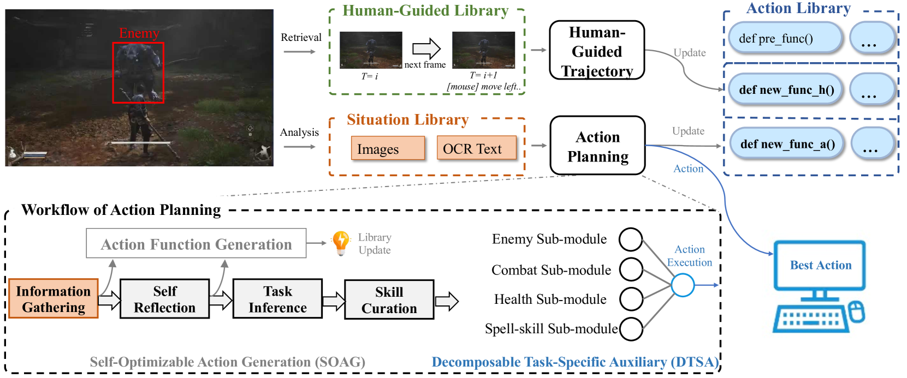

https://arxiv.org/html/2409.12889v1

#### 1. Introduction
挑战: Immediate visual input, Action-oriented tasks
ARPG一般没有提供很多的文字提示, 大多数的行为需要从经验和自我创新中学习
#### 2. Methodology

完整的流程:
0. 拿到当前的游戏截图
1. human-guided trajectory system: 是从人类操作的库中找到最相似的操作, 由真实数据收集来的各种人类在面临一个场景做出的鼠标+键盘操作的py代码
2. action planning system: 是根据图像信息拿到当前图片的描述(通过OCR+视觉大模型)判断出situation, 然后走Action planner流程(就是上图下面部分虚线框中部分), Action Planning分类两部分:
	1. Self-Optimizable Action Generation(SOAG)
	2. Decomposable Task-Specific Auxiliary(DTSA): 下面有, 分解为了5个模块

有好几个Library, 这几个lib都可以用于检索和更新, 用于存放自我学习+人类指引
	1. Human-Guided: 
	2. Actions:
		1. `pre_func`: 代表预先定义的action
		2. `new_func_a`: 代表action planning system生成的
		3. `new_func_h`: 代表human-guided trajectory system生成的
	3. Situation:

##### 2.1 Overview
##### 2.2 Action Planning System

###### 2.2.1 Basic VLMs Group
Inspired by [Cradle](https://arxiv.org/html/2409.12889v1#bib.bib22), our main pipeline continues to adopt the five basic modules from Cradle

1. Information Gathering: 文本信息主要包括文本指南、文本标签和通知(OCR). 视觉信息主要包括环境位置、角色动作和界面图标(目标检测).
2. Self Relection: 取视频的最后几帧, 去Situation lib中看最后执行的动作是否成功地产生了正确的效果，以及当前任务是否已经完成. 如果执行失败了, 要为后面的action生成提供失败的原因.
3. Task Inference: 根据前面模块的执行结果推断出当前需要执行的任务，并生成任务描述. **没懂**
4. Skill Curation: 计算任务描述的embedding与action lib中文本注释的embedding之间的相似度，找到一些匹配的动作，形成候选action set。
5. Decision Making: 利用COT, 对一些问题进行顺序的reasoning, 例如: 是否开启战斗模式/是否恢复血量/是否选择技能等. 最后模块从action set中推断出最适合的action, 执行python代码, 操作键盘和鼠标.

> 这5个基本的模块, 会记录每个中间步骤到situation lib中

###### 2.2.2 **Self-Optimizable Action Generation Module**
self-optimizable action generation module (SOAG): VARP agent框架总结敌人的actions, 优化目前的actions, 推断生成新的action

生成新的指令由如下两种组成: 躲避+轻攻击

优化的目标: 最大限度地逃避敌人的攻击 + 打击敌人的同时最小化玩家角色的生命损失

###### 2.2.3 **Decomposable Task-Specific Auxiliary** Modules
VLM随着输入变长, attention的分布会被稀释.

解决办法: 通过将原来的模块分解, 添加多个并行的辅助子模块
将原来的decision-making模块(处理多个任务), 分解为5个子模块:
1. Enemy: 用于分析敌人的状态(例如血量/位置等), 帮助agent获取敌人的具体信息
2. Combat: 通过观察游戏屏幕右下角的重攻击状态来决定使用哪种战斗方法，包括轻攻击或重攻击。
3. Health: 负责持续监控玩家的生命值条。如果生命值消耗过度，则通过优先恢复生命值
4. Spell-skill: 监控玩家的技能状态，同时分析战斗状态中的情况，以确定使用可用技能的适当时间。
5. The integration: 集成所有子模块的输出并进行推理，以从候选操作集中确定当前特定任务的最佳操作。通过这样分解的办法, 显著提高了decision-making的准确性

##### 2.3 Human-Guided Trajectory System
**人工指引数据集**保存了游戏的截图和用户的输入, 还有时间戳

对于复杂的任务(例如幽魂, 自动寻路), 先拿到当前的截图和后面n帧的截图, 做查询, 找到最相似的图片, 然后找到对应的用户输入. 然后输出新的动作，然后将其存储在动作库中，供行动计划系统选择和执行。

#### 3. Experiments
##### 3.1 数据收集
200个志愿者(70%没有玩过), 剔除了无效数据(完成task的)
有时候可能左键点击了7/8次, 但是只是完成了5次攻击, 这样的数据不是干净的

##### 3.2 Benchmark and Task definition
基准测试方面，允许agent对每个任务测试5次，并计算每个任务的成功率
对于战斗的Task, 通过了视为成功, 死亡了视为失败
对12个Task都手动进行了标注, 分别为简单/中等/难/非常难
- 因为没有地图+空气墙, 寻路被视为了非常难

##### 3.3 实现细节
1920\*1.80
GPT-4o-2024-05-13, Claude 3.5 Sonnet, Gemini 1.5 pro
DINO[[14](https://arxiv.org/html/2409.12889v1#bib.bib14)]: 目标检测

##### 3.4 Performance Evaluation

##### 3.5 Ablation Study

#### 引用的其他有意思的论文
[Cradle: Empowering foundation agents towards general computer control](https://arxiv.org/html/2409.12889v1#bib.bib22)
Voyager: An open-ended embodied agent with large language models, 2023.
- VLM-based, Minecraft, agent framework, API
Creative agents: Empowering agents with imagination for creative tasks, 2023.
- VLM-based, Minecraft, API+Screen

其它各个领域的应用:
- Mind2web: Towards a generalist agent for the web, 2023.
- A real-world webagent with planning, long context understanding, and program synthesis, 2024.
- Webvoyager: Building an end-to-end web agent with large multimodal models, 2024.
- Mobile-agent: Autonomous multi-modal mobile device agent with visual perception, 2024.
- Appagent: Multimodal agents as smartphone users, 2023.

应用在游戏:
- In Proceedings of the 62nd Annual Meeting of the Association for Computational Linguistics (Volume 1: Long Papers), pages 15174–15186, 2024.
- Agent hospital: A simulacrum of hospital with evolvable medical agents.arXiv preprint arXiv:2405.02957, 2024.
- Generative agents: Interactive simulacra of human behavior.In Proceedings of the 36th annual acm symposium on user interface software and technology, pages 1–22, 2023.
- Jarvis-1: Open-world multi-task agents with memory-augmented multimodal language models, 2023.
- Describe, explain, plan and select: Interactive planning with large language models enables open-world multi-task agents, 2024.

#### 4. 一些想法
既然大模型可以模拟用户的行为, 然后自优化, 那我可不可以写一个agent框架, 根据用户的行为+situation, 也变得越来越强
- 记录用户的指令, 这样底层这个boss可以根据和镜像对练, 找到更好的解空间

其他和游戏相关的:
1. 爬塔? 肉鸽? boss闯关?
2. 弹反? 因为黑神话的动作系统和弹反玩起来很不爽, 所以想弄一个爽快的弹反boss战
3. 你可以分享自己的boss参数, 让别人试试针对你的操作训练出来的boss
