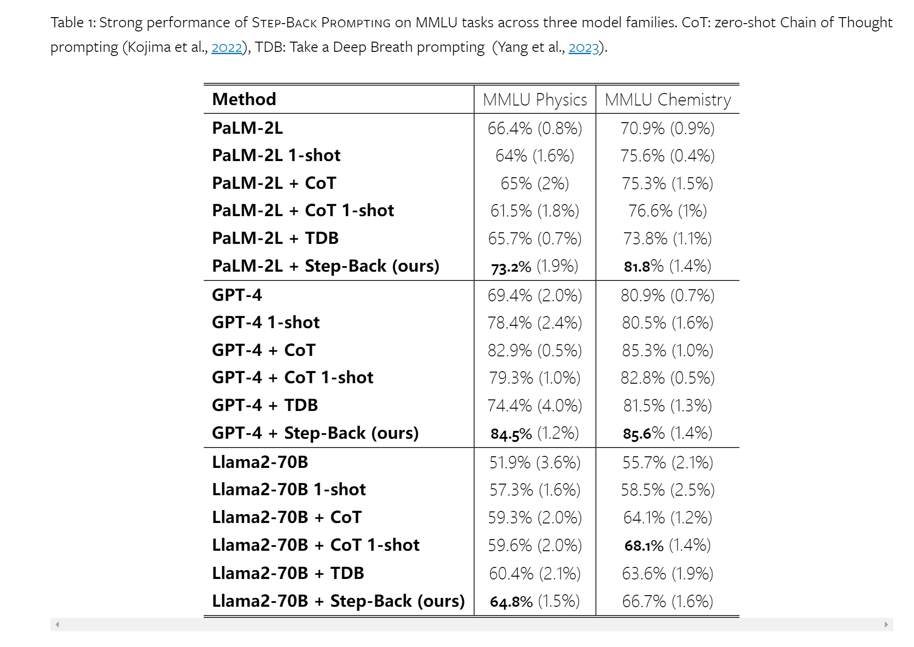

Grounding the reasoning on top of such abstractions helps to avoid reasoning errors in the intermediate steps such as the example shown in Figure [2](https://arxiv.org/html/2310.06117v2#S1.F2 "Figure 2 ‣ 1 Introduction ‣ Take a Step Back: Evoking Reasoning via Abstraction in Large Language Models") (left) from Chain-of-Thought.
> 在抽象的基础上进行推理, 可以避免中间步骤的干扰

Furthermore, abstract questions such as what is the employment history of Steve Jobs? are often generic in nature to have a many-to-one mapping since many questions (e.g. which employer did Steve Jobs work for in 1990? and which employer did Steve Jobs work for in 2000?) can have the same abstract question.
> 一个抽象的问题, 其实可以对应具体的多个问题. 如史蒂夫·乔布斯的工作经历是什么?通常在本质上具有多对一映射，因为许多问题(例如，史蒂夫·乔布斯在1990年为哪家雇主工作?史蒂夫·乔布斯在2000年为哪家雇主工作?)也可以有同样的抽象问题。
> 这个方法和`decomposition`还不一样, `decomposition`通常是一对多, 一个问题可以拆解为多个问题i

> 使用的PaLM-2L + few-shot来叫模型进行evaluation, 评估prediction和answer是否相等

This corroborates with the finding in the ablation study above that very few exemplars are needed to demonstrate to LLMs the Abstraction skill
- 向LLMs展示抽象技能所需的样本很少

Reasoning step is still the bottleneck of how well Step-Back Prompting can perform tasks such as MMLU requiring complex reasoning.

## BaseLine Methods
**PaLM-2L**, **PaLM-2L 1-shot**

**PaLM-2L + CoT**, **PaLM-2L + CoT 1-shot**
- COT: “*Let’s think step by step*” is appended to the question

**PaLM-2L + TDB**: Zero-shot prompting with “*Take a deep breath and work on this problem step-by-step.*” (Yang et al., [2023](https://arxiv.org/html/2310.06117v2#bib.bib31)) prepended to the question.

**PaLM-2L + RAG**: 

**GPT-4 and Llama2-70B**: 在GPT-4与Llama2-70B上跑上面的方法


## Knowledge QA
在这里, 抽象出来的问题, 被用于获取相关facts, 然后作为额外的context放到prompt中, 见下面的`Knowledge QA Final-Answer Prompt`

COT TDB发现没有啥提升
step-back之后, 结合RAG, 效果有提升

## MMLU Physics/Chemistry
### MMLU Physics/Chemistry First-Principle Prompt:
```
You are an expert at Physics/Chemistry. You are given a Physics/Chemistry problem. Your task is to extract the Physics/Chemistry concepts and principles involved in solving the problem. Here are a few examples:  
  
Question: <Question Example1>  
Principles Involved: <Principles Example1>  
…  
Question: <Question Example5>  
Principles Involved: <Principles Example5>  
Question: <Question>  
Principles Involved:
```

### MMLU Physics/Chemistry Final Answer Prompt:
```
You are an expert at Physics/Chemistry. You are given a Physics/Chemistry problem and a set of principles involved in solving the problem. Solve the problem step by step by following the principles. Here are a few examples:  
  
Question: <Question Example1>  
Principles: <Principles Example1>  
Answer: <Answer Example1>  
…  
Question: <Question Example5>  
Principles: <Principles Example5>  
Answer: <Answer Example5>  
Question: <Question>  
Principles: <Principles>  
Answer:
```

## Knowledge QA
### Knowledge QA Step-Back Prompt:
```
You are an expert at world knowledge. Your task is to step back and paraphrase a question to a more generic step-back question, which is easier to answer. Here are a few examples:  
  
Original Question: <Original Question Example1>  
Stepback Question: <Stepback Question Example1>  
…  
Original Question: <Original Question Example5>  
Stepback Question: <Stepback Question Example5>  
Original Question: <Original Question>  
Stepback Question:
```

### Knowledge QA Final-Answer Prompt
```
You are an expert of world knowledge. I am going to ask you a question. Your response should be comprehensive and not contradicted with the following context if they are relevant. Otherwise, ignore them if they are not relevant.  
  
<Passage from original retrieval augmentation>  
<Passage from step-back retrieval augmentation>  
  
Original Question: <Original Question>  
Answer:
```

## standard zero-shot few-shot prompt
### Baseline few-shot Prompt
```
You are an expert of world knowledge and physics. Your task is to solve the following question. Here are a few examples:  
  
Question: <Question Example>  
Answer: <Answer Example>  
Question: <Question>  
Answer:
```

### COT
For zero-shot CoT prompting, we simply append *Let’s think step by step*. to the question to query the model.

### Take a Deep Breath (TDB)
We study the zero-shot prompting found in Yang et al. ([2023](https://arxiv.org/html/2310.06117v2#bib.bib31)): *we take Take a deep breath and work on this problem step-by-step*, and prepend it to the question.
- 加到问题最前面

## reference
https://arxiv.org/html/2310.06117v2#A4.T16