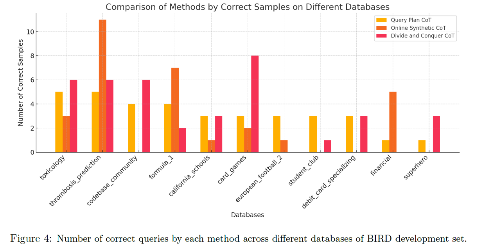

## 总结
关键的selection agent没有多余细节。其他有用的信息：
1. 不同SQL生成方法有不同的适用环境。总的来说注入合成示例+SQL修复的效果提升相对更高

一些其他论文中也用到的：
1. 根据问题过滤相关的table+column（缩小问题范围）
2. 提取查询中的关键词，根据关键词查关键词找到关键词关联的解空间（避免拼写错误，减小llm的选择范围）

## 整体处理步骤:
1. value retrieval: 
2. candidate generator: 使用三种不同的方法生成SQL: **Divide and Conquer CoT**、**Query Plan CoT**、**Online Synthetic Example Generation**
3. query fixer
4. selection agent


左边的图说明了，在基线上加上不同的方法，各自提高了多少。OS CoT+query fixer效果最好。
右边的图说明了，最终形态上，去除哪个影响最小，去除哪个组件影响最大。可以看到ranker agent影响最大（也就是两两比较选正确的SQL的agent，本篇论文没有详细讲，只大概提了一点）。
### value retrieval
先使用llm+few-shot提取关键词, 用的和这篇论文一样的方法(https://arxiv.org/html/2405.16755), TODO: 看怎么做的

对提取出来的每个关键词, 使用locality-sensitive hashing的方法, 检索语法最相似的单词。然后基于embedding或者编辑距离来进行re-rank。这种方法可以解决错误的单词拼写等关键词问题。

### multi candidate generation
他们为了得到更多不同的结果，提高了temperature，然后打乱prompt中的columns和tables

使用了三种不同的方法, 各自适用于不同的场景(图3a)

从下图看到, Query Plan CoT在各个场景的表现都比较平均. Online Synthetic CoT在个别场景对的明显更多, 但是有点场景又一个都没有对. Divide and Conquer CoT个别与Query Plan Cot持平, 个别比Query Plan Cot高, 个别又比Query Plan Cot低, 甚至为0了. 总的来看, Query Plan Cot比较均衡, Online Synthetic CoT和Divide and Conquer CoT在个别场景会提供更多的可能性, 如果配合好的selection agent, 那么最终的答案效果就会更好.(强依赖selection agent, 这篇论文只简单提了是怎么做的。。。)


#### Divide and conquer
提供了一个示例，但是太具体了，没有提供真正的prompt模板

#### Query Plan Cot
提供了一个示例，但是太具体了，没有提供真正的prompt模板
```python
Database Info
{DATABASE_SCHEMA}
**************************
Answer Repeating the question and evidence, and generating the SQL with a query plan.
**Question**: How many Thai restaurants can be found in San Pablo Ave, Albany?
**Evidence**: Thai restaurant refers to food_type = ’thai’; San Pablo Ave Albany refers to street_name = ’san pablo ave’ AND T1.city = ’albany’
**Query Plan**:
** Preparation Steps:**
1. Initialize the process: Start preparing to execute the query.
2. Prepare storage: Set up storage space (registers) to hold temporary results, initializing them to NULL.
3. Open the location table: Open the location table so we can read from it.
4. Open the generalinfo table: Open the generalinfo table so we can read from it.
** Matching Restaurants:**
1. Start reading the location table: Move to the first row in the location table.
2. Check if the street matches: Look at the street_name column of the current row in location. If it’s not "san pablo ave," skip this row.
3. Identify the matching row: Store the identifier (row ID) of this location entry.
4. Find the corresponding row in generalinfo: Use the row ID from location to directly find the matching row in generalinfo.
5. Check if the food type matches: Look at the food_type column in generalinfo. If it’s not "thai," skip this row.
6. Check if the city matches: Look at the city column in generalinfo. If it’s not "albany," skip this row.
** Counting Restaurants:**
1. Prepare to count this match: If all checks pass, prepare to include this row in the final count.
2. Count this match: Increment the count for each row that meets all the criteria.
3. Move to the next row in location: Go back to the location table and move to the next row, repeating the process until all rows are checked.
4. Finalize the count: Once all rows have been checked, finalize the count of matching rows.
5. Prepare the result: Copy the final count to prepare it for output.
** Delivering the Result:**
1. Output the result: Output the final count, which is the number of restaurants that match all the
specified criteria.
2. End the process: Stop the query execution process.
3. Setup phase: Before starting the actual query execution, the system prepares the specific values it will be looking for, like "san pablo ave," "thai," and "albany."
**Final Optimized SQL Query:**
SELECT COUNT(T1.id_restaurant) FROM generalinfo AS T1 INNER JOIN location AS T2 ON T1.id_restaurant = T2.id_restaurant WHERE T1.food_type = ’thai’ AND T1.city = ’albany’ AND T2.street_name = ’san pablo ave’
```
> 可以把前面提供的示例作为一个example，然后把input、db_schema替换了

#### Online Synthetic Example Generation
从测试结果来看, 这种方法在不同场景中提供的SQL, 提供了更多的多样性(有些场景这种方法正确的多, 或者只有这种方法正确)

这个部分涉及到生成两种不同的examples, 第一种是基于schema生成一些常用SQL操作的示例. 基于生成没有使用JOIN, 使用了JOIN, 使用了聚合(例如COUNT)的这些例子. prompt如下: 
```python
You are a SQLite SQL expert. Your job is to create {k} examples, where each example consists of a question and a SQL query to fetch the data for it. I want each example to look like this, question input
and SQL output pairs:
"input": "What’s the description of the series code SM.POP.TOTL for Aruba? (Hints: Aruba is the name of the country where ShortName = ’Aruba’)"
"output": "SELECT T2.Description FROM Country AS T1 INNER JOIN CountryNotes AS T2 ON T1.CountryCode = T2.Countrycode WHERE T1.ShortName = ’Aruba’ AND T2.Seriescode = ’SM.POP.TOTL’"

You should generate examples that examine and showcase different aspects and relationships of the following table schemas, described in "Table creation statements". Understand the database tables and their relationships. Understand the columns and their types and meanings to construct intresting examples.

Generate a mixture of SQL examples that include:
• some simple SQL query examples without JOIN
• some SQL query examples with aggregates, like COUNT
• some simple SQL query examples with JOIN
• some complex SQL query examples with nested JOIN
**************************
Table creation statements
{TARGET_DATABASE_SCHEMA}
**************************
Generate total of {k} examples. Only outputs the examples (question input and SQL output pairs), and each example can be separated by a new line.
```
> 图23a提供了最常用的是哪些SQL语法, 例如inner join/count等
> 这里生成的SQL examples里面可能涉及和输入不相关的列/问题/答案

第二种SQL示例是, 只注入(通过过滤得到的)和问题相关的table+column来生成的SQL示例. prompt如下:
```python
You are a SQLite SQL expert. Your job is to create a set of examples, where each example consists of a question and a SQL query to fetch the data for it.
You should generate examples that examine and showcase different aspects and relationships of the following table schemas. Understand the database tables and their relationships. Understand the columns and their types and meanings to construct intresting examples.
I will also show you multiple examples generated for the other database and its table schemas, so you can see what kind of examples can be generated for a given database.
**************************
###Examples from other database### 
The following is the table schemas and column examples for other database:
The database ({TRAIN_DATABASE_NAME}) structure is defined by the following table schemas(comments after ’–’ provide additional column descriptions).
{TRAIN_DATABASE_SCHEMA}
————————
The folloiwing are the examples generated for the above database schemas:
Example 1) "input": "Among the countries in the group of Heavily Indebted Poor Countries, how many of them are under the lending category of the International Development Associations?(Hints: group of Heavily Indebted Poor Countries is OtherGroups = ’HIPC’; International Development Associations refers to lendingcategory = ’IDA’)"
"output": "SELECT COUNT(CountryCode) FROM Country WHERE LendingCategory = ’IDA’ AND OtherGroups = ’HIPC’"
...
Example 10) "input": "What is the description of the footnote on the series code AG.LND.FRST.K2 in 1990 for Aruba?(Hints: Year = 1990; Aruba is the name of country where ShortName = ’Aruba’)"
"output": "SELECT T2.Description FROM Country AS T1 INNER JOIN FootNotes AS T2 ON T1.CountryCode = T2.Countrycode WHERE T1.ShortName = ’Aruba’ AND T2.Seriescode = ’AG.LND.FRST.K2’ AND T2.Year = ’YR1990’"
**************************
Now similarly, generate examples (question input and SQL output pairs) for the table schemas defined below, in "Table creation statements".
**************************
###Table creation statements###
{TARGET_DATABASE_SCHEMA}
**************************
Only outputs the examples (question input and SQL output pairs), and each example can be separated by a new line.
```
> 注意: 这个prompt注入的examples是另一个train_db的例子(few-shot). 然后最后才是注入的当前db的schema(target_database_schema)

### query fixer
使用诸如语法错误细节或空结果集之类的反馈来指导纠正过程。迭代循环修复最多3次
prompt:
```python
**Task Description:**
You are an SQL database expert tasked with correcting a SQL query. A previous attempt to run a query did not yield the correct results, either due to errors in execution or because the result returned was empty or unexpected. Your role is to analyze the error based on the provided database schema and the details of the failed execution, and then provide a corrected version of the SQL query.

**Procedure:**
1. Review Database Schema:
- Examine the table creation statements to understand the database structure.
2. Analyze Query Requirements:
- Original Question: Consider what information the query is supposed to retrieve.
- Hint: Use the provided hints to understand the relationships and conditions relevant to the query.
- Executed SQL Query: Review the SQL query that was previously executed and led to an error or
incorrect result.
- Execution Result: Analyze the outcome of the executed query to identify why it failed (e.g., syntax
errors, incorrect column references, logical mistakes).
3. Correct the Query:
- Modify the SQL query to address the identified issues, ensuring it correctly fetches the requested data
according to the database schema and query requirements.

**Output Format:**
Present your corrected query as a single line of SQL code, after Final Answer. Ensure there are no line breaks within the query.

Here are some examples:
{EXAMPLES}
======= Your task =======
**************************
Table creation statements
{DATABASE_SCHEMA}
**************************
The original question is:
Question:
{QUESTION}
Evidence:
{HINT}
The SQL query executed was:
{QUERY}
The execution result:
{RESULT}
**************************
Based on the question, table schema and the previous query, analyze the result try to fix the query.
```

### selection agent
有了一组高质量和多样化的候选SQL，最直接的解决方案是使用现成的llm进行两两选择。在Gemini-1.5-pro上进行的实验表明使用未进行微调的LLM，二元分类准确率仅为58.01%（问题在于两个候选的两个SQL很类似）

本篇论文自己训练专用于SQL的二分类模型，首先在训练集（Text-to-SQL benchmarks）上生成候选SQL查询，并根据它们的执行结果将它们分组到不同cluster，这样确保一个cluster有正确答案。
训练涉及到(Qu,Ci,Cj ,Dij , yij)，分别是用户输入、候选SQL1、候选SQL2、候选SQL关联的db_schema、0/1（代表选择第一个/第二个为正确的SQL）

给了prompt，但是效果其实很大程度上依赖与他们自己微调后的模型，专门用于判断两个SQL哪个更符合需求。
```python
Instruction:
Given the DB info and question, there are two candidate queries. There is correct one and incorrect one, compare the two candidate answers, analyze the differences of the query and the result. Based on the original question and the provided database info, choose the correct one.
**************************
Database Schema
{DATABASE_SCHEMA}
**************************
Question:
{QUESTION}
Evidence:
{HINT}
**************************
Candidate A
{CANDIDATE_A_QUERY}
Execution result
{CANDIDATE_A_RESULT}
**************************
Candidate B
{CANDIDATE_B_QUERY}
Execution result
{CANDIDATE_B_RESULT}
Just output the correct answer "A" or "B".
```

## reference
https://arxiv.org/html/2410.01943