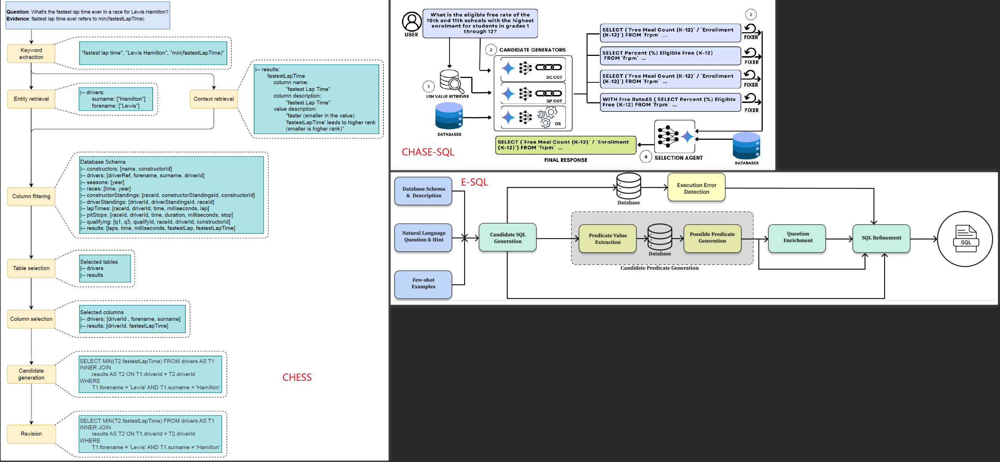

[CHESS: Contextual Harnessing for Efficient SQL Synthesis](https://arxiv.org/abs/2405.16755)

[CHASE-SQL: Multi-Path Reasoning and Preference Optimized Candidate Selection in Text-to-SQL](https://arxiv.org/html/2410.01943)

[E-SQL: Direct Schema Linking via Question Enrichment in Text-to-SQL](https://arxiv.org/abs/2409.16751)

### 三篇论文的处理流程汇总:

### 技巧
1. **关键词提取**: 从输入从提取出关键词(可能包含实体)
2. **过滤需要用到的table**, **过滤需要用到的column**
3. **重写输入**+**丰富输入**
4. 根据提取关键词召回涉及到的**table.column的一些具体的可能值(也可以注入静态的)**
	1. 如果column可以为Null，那么注入的值最好有Null的示例。
5. SQL生成的时候, 可以使用规划/分治/示例合成的方法
	1. 规划: prompt中有说明, 模拟SQL的执行计划进行分析
	2. 分治: prompt中说明+一个示例说明先完成子查询再组装
	3. **示例合成**: 生成两种不同的examples(**可以注入选好的, 静态的示例**)
		1. 第一种是基于schema生成一些常用SQL操作的示例. 基于生成没有使用JOIN, 使用了JOIN, 使用了聚合(例如COUNT)的这些例子
		2. 第二种SQL示例是, 只注入(通过过滤得到的)和问题相关的table+column来生成的SQL示例
6. SQL生成完, 执行拿到执行结果(**只能拿到是否执行成功**), 有问题走**修复流程(fix/refinement/revision)**, 最后在多个SQL中优选一个
> 前面的文字中有加粗的，都是可以找到对应的prompt的。
> CHESS和E-SQL代码中的细节没有体现

> 如果数据库中没有数据, 那么无法拿到SQL执行结果来优化, 无法动态根据输入中过滤出来的关键词来查询相关的table.column的值。